<!-- Header -->
<picture>
  <source media="(prefers-color-scheme: dark)" srcset="assets/header-dark.svg">
  <source media="(prefers-color-scheme: light)" srcset="assets/header-light.svg">
  
</picture>

<!-- Profile Views -->
<p align="right">
  <a href="https://github.com/LucasMonteiro10">
    
  </a>
</p>

<!-- Typing SVG -->
<p align="center">
  <a href="https://github.com/LucasMonteiro10">
    
  </a>
</p>

<!-- Social Links -->
<p align="center">
  <a href="https://www.linkedin.com/in/lucas-monteiro-vilela/" target="_blank">
    
  </a>&nbsp;
  <a href="https://github.com/LucasMonteiro10" target="_blank">
    
  </a>
</p>

<br>

<!-- About Me -->
## `> about_me.ts`

```typescript
const lucasMonteiro = {
    name: "Lucas Monteiro Vilela Barbosa",
    location: "Recife, Brazil 🇧🇷",
    role: "Quality Assurance Engineer",
    onGitHubSince: 2021,
    languages: ["Java", "Kotlin", "C#", "TypeScript", "JavaScript"],
    qa: {
        automation: ["Playwright", "Selenium", "Cucumber"],
        methodologies: ["BDD", "Unit Tests"]
    },
    development: {
        backend: ["Java", "Spring", ".NET"],
        mobile: ["Kotlin", "Android"],
        frontend: ["HTML", "CSS", "JavaScript"]
    },
    tools: ["Git", "GitHub", "IntelliJ IDEA", "Android Studio", "VS Code"],
    currentFocus: "Ensure end-to-end quality with automated testing."
};
```

<br>

<!-- Tech Stack -->
## `> tech_stack`

<p align="center">
  <a href="https://skillicons.dev">
    
  </a>
</p>

<br>

<!-- Featured Projects -->
## `> featured_projects`

<p align="center">
  <a href="https://github.com/LucasMonteiro10/Agenda-Pessoal">
    
  </a>&nbsp;&nbsp;
  <a href="https://github.com/LucasMonteiro10/swag-labs-selenium">
    
  </a>
</p>
<p align="center">
  <a href="https://github.com/LucasMonteiro10/BDD-Discover">
    
  </a>&nbsp;&nbsp;
  <a href="https://github.com/LucasMonteiro10/ScoreG">
    
  </a>
</p>
<p align="left">
  <a href="https://github.com/LucasMonteiro10?tab=repositories" target="_blank">
    
  </a>
</p>

<br>

<!-- GitHub Stats -->
## `> github_stats`

<p align="center">
  <a href="https://github.com/LucasMonteiro10">
    
  </a>&nbsp;&nbsp;
  <a href="https://github.com/LucasMonteiro10">
    
  </a>
</p>

<p align="center">
  <a href="https://github.com/LucasMonteiro10">
    
  </a>
</p>

<br>

<!-- Footer -->
<picture>
  <source media="(prefers-color-scheme: dark)" srcset="assets/footer-dark.svg">
  <source media="(prefers-color-scheme: light)" srcset="assets/footer-light.svg">
  
</picture>
